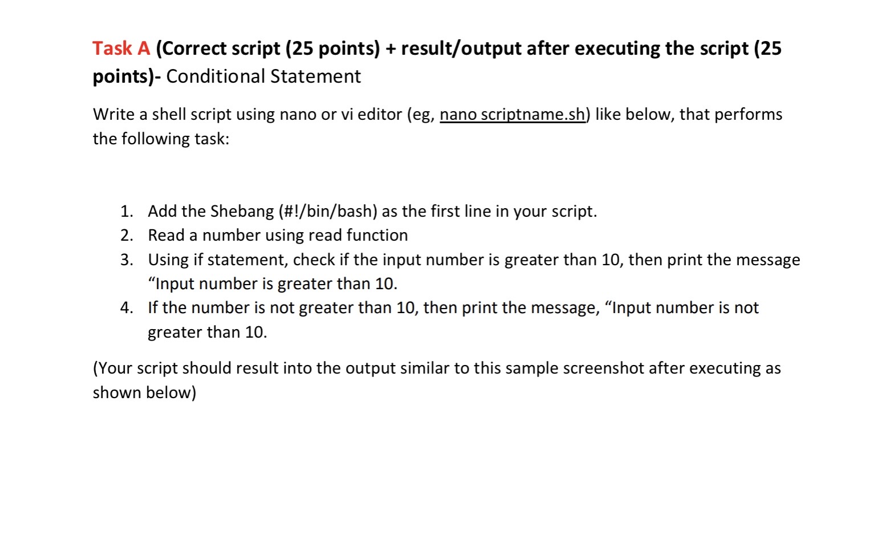
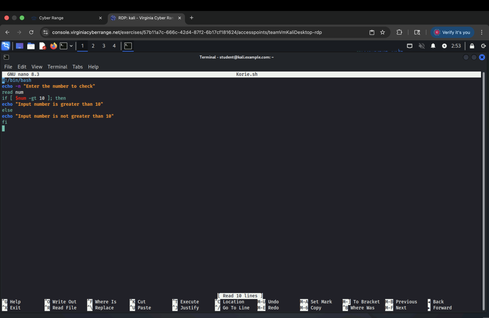
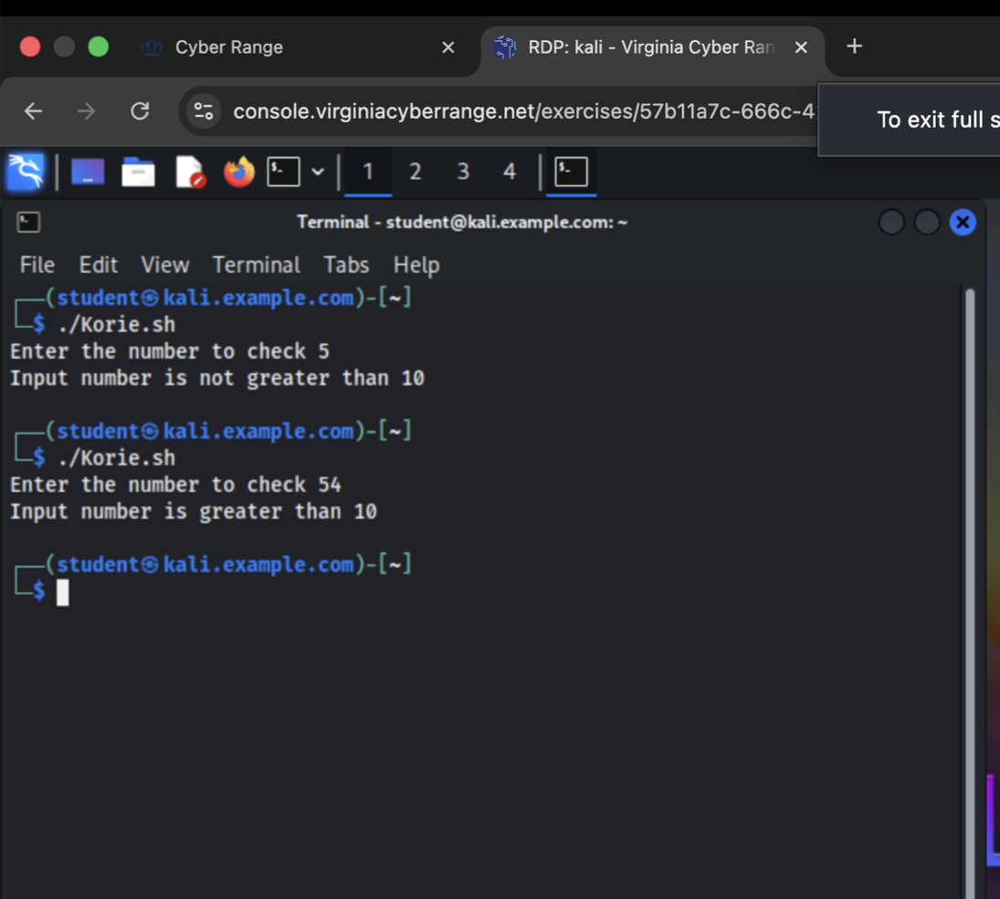
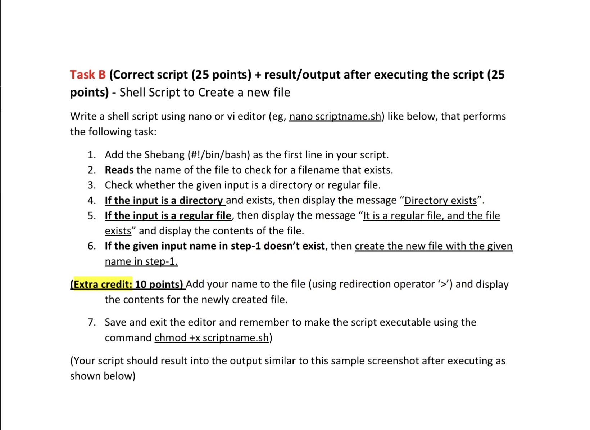
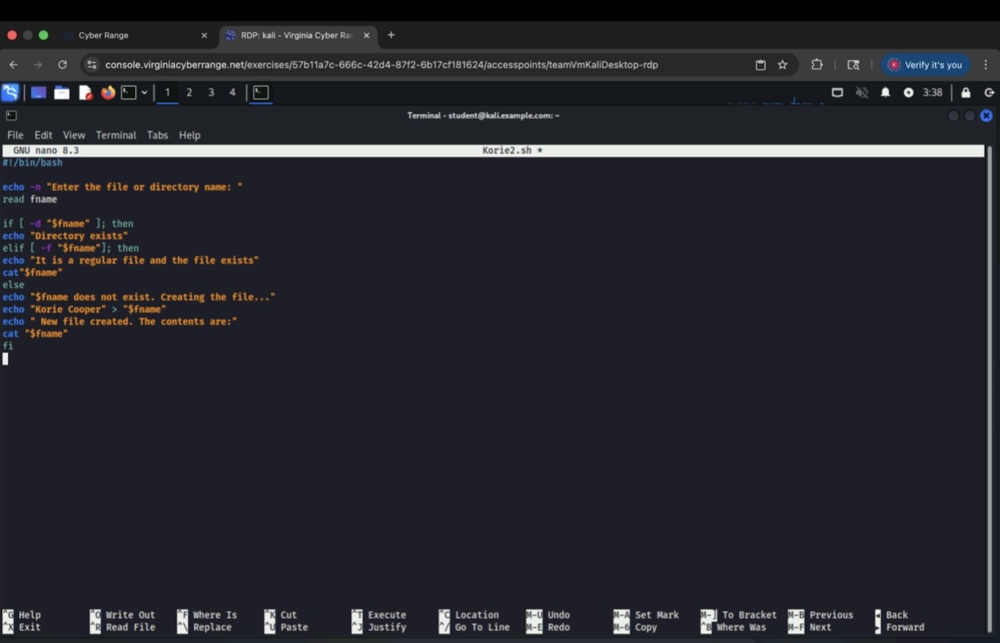
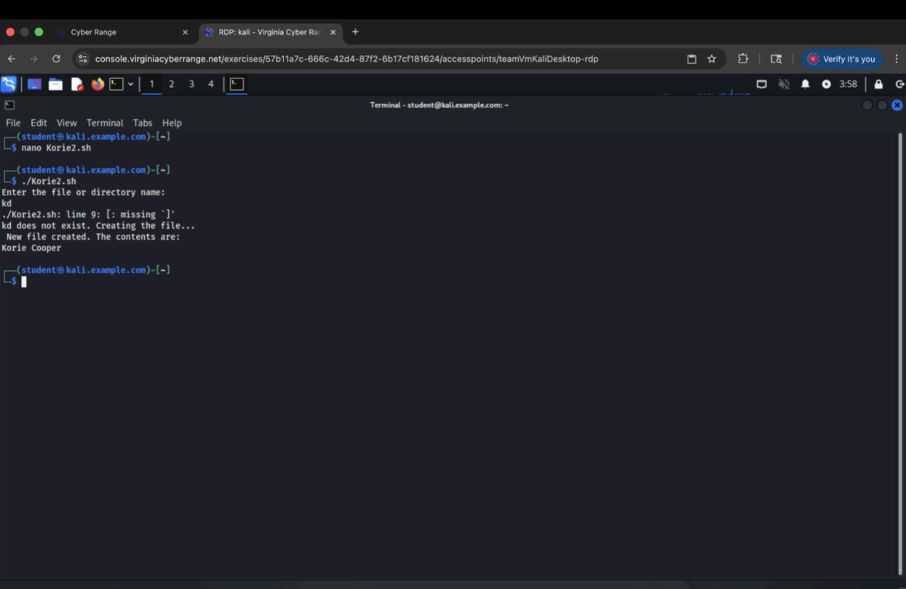

# Intro to Bash Conditional Logic File Checks
Created multiple Bash scripts to practice Linux skills, including using if-statements, checking files/directories, and auto-creating files. Learned how to run, test, and troubleshoot scripts in the terminal.
<h2>Languages and Utilities Used</h2>

- <b> Bash Shell </b> 

<h2>Environments Used </h2>

- <b>Kali Linux VM </b>

<h2>Program walk-through:</h2>

Task A assigned for the lab:   

 
 

 
 
 

 
 
Task B assigned for the lab:   

 
 

 
 
 

 
 

